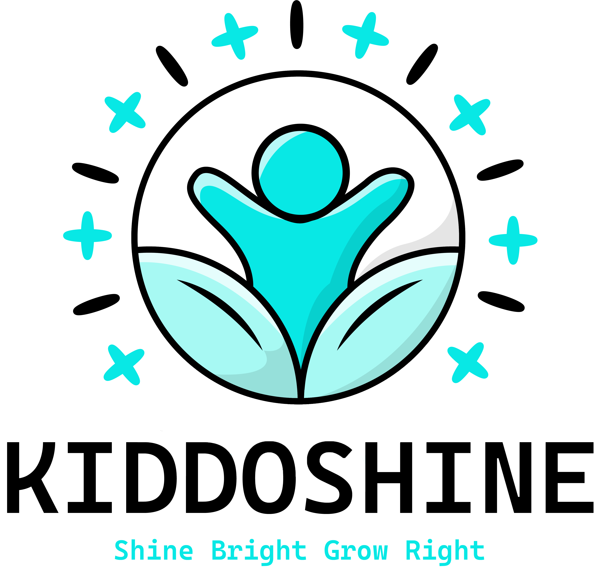
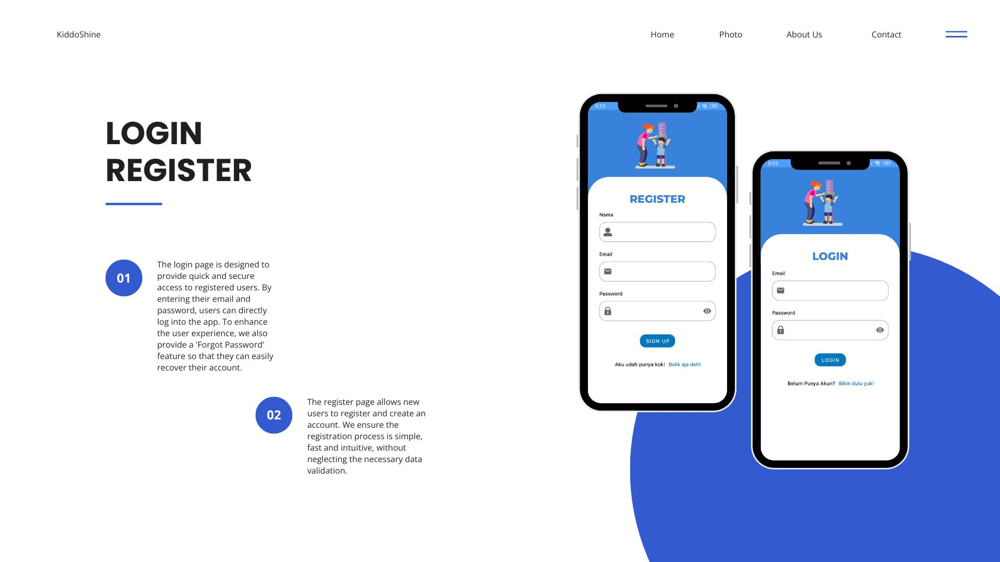
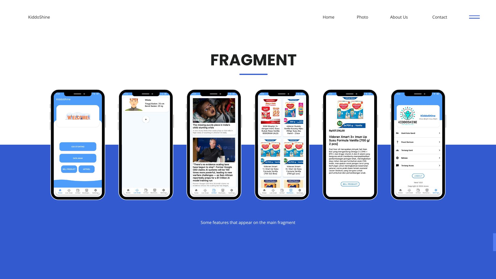
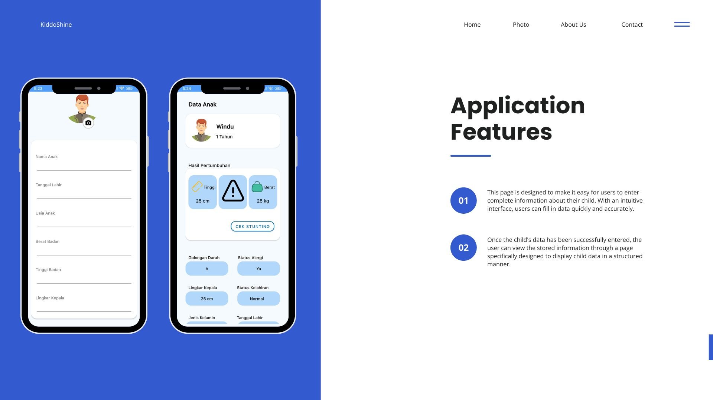
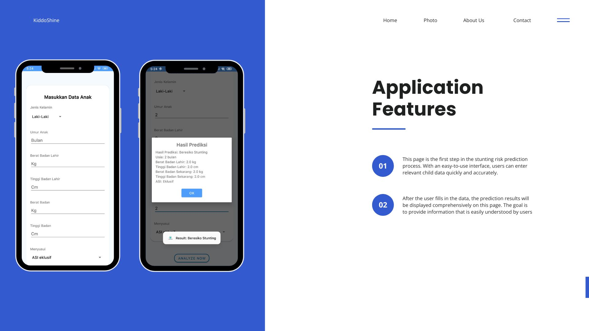

<h1>Mobile Application</h1>
  
The project involved developing an Android app with a focus on user experience that suits the target market. We designed a simple and attractive interface using XML layout, and ensured efficient data handling through view models, adapters, and Retrofit for smooth API communication. In addition, we integrated Model-View-ViewModel architecture in our project. ViewModel maintains data consistency despite lifecycle changes, while Repository manages data flow between views and data sources. We also used Room Database for efficient local data storage and secure offline access. Overall, this project not only provides a visually appealing application, but also is efficient in data management, responsive to user interaction, and prioritizes data security so that it can be used optimally. 

## Mobile Team

- Ibrahim Ali Abel- [Github@Ibrahim Ali Abel](https://github.com/IbrahimAliAbel)-Mobile Development(`MD-08`)-Universitas Amikom Purwokerto
- Tegar Romadhany-[Github@Tegar Romadhany](https://github.com/rtegar)-Mobile Development(`MD-18`)-Universitas Amikom Purwokerto

## App Features
  
  
  
  
  
## Tools & Libraries
- [Android Studio](https://developer.android.com/studio)
- [Retrofit](https://square.github.io/retrofit/)
- [Room](https://developer.android.com/jetpack/androidx/releases/room)
- [Figma](https://www.figma.com/)
- [Kotlin](https://kotlinlang.org/)

## Aplication Download & Demo Application

- Application Link: [KiddoShine](https://drive.google.com/file/d/1zsk4luusuGapibc4UGPYVCysEUS_1GTO/view?usp=drive_link)
- Demo Application: [KiddoShine](https://drive.google.com/file/d/19XRtOnvo9TuWcEA2f-PHTlC6wMD6qhHK/view?usp=drive_link)

## Mobile Development Architecture [Model-View-ViewModel Architecture]

  
We use model-view-viewmodel architecture for building the apps. Here, we divide parts into the ui layer and data layer. In the ui layer, we used a ViewModel that incorporates LiveData to supply observed data to the activity. To get the data, view models are connected to the repository through a view model factory. The repository itself is located in the data layer and used to manage data sources both from local data source and remote data source. For the local data source, we implement Room to establish the database. As for the remote data source, Retrofit is used to interact with web services.

## 🔗 Social Media
**Ibrahim Ali Abel**

